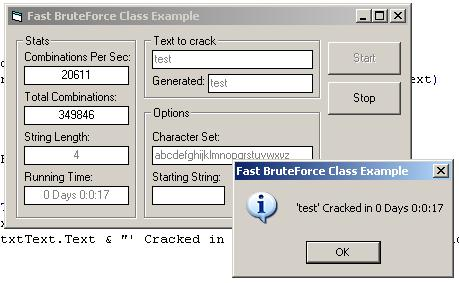

## Fast BruteForce Class Example

### Description

By request here is an example on how to use the BruteForce Class.

This Program will do a plain text crack against the text specified.

This code is currently fastest bruteforce code on PSC at over 20,000 combinations per second running on a Celeron 900.

Please remember to Vote and Comment
 
### More Info
 

             |
---                |---
**Submitted On**   |2003-09-05 19:57:38
**By**             |[�e7eN](https://github.com/Planet-Source-Code/PSCIndex/blob/master/ByAuthor/e7en.md)
**Level**          |Beginner
**User Rating**    |4.1 (29 globes from 7 users)
**Compatibility**  |VB 6\.0
**Category**       |[Encryption](https://github.com/Planet-Source-Code/PSCIndex/blob/master/ByCategory/encryption__1-48.md)
**World**          |[Visual Basic](https://github.com/Planet-Source-Code/PSCIndex/blob/master/ByWorld/visual-basic.md)
**Archive File**   |[Fast\_Brute164287982003\.zip](https://github.com/Planet-Source-Code/e7en-fast-bruteforce-class-example__1-48276/archive/master.zip)

